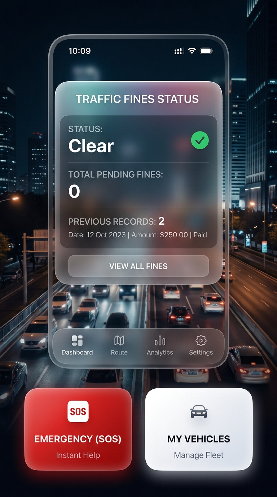
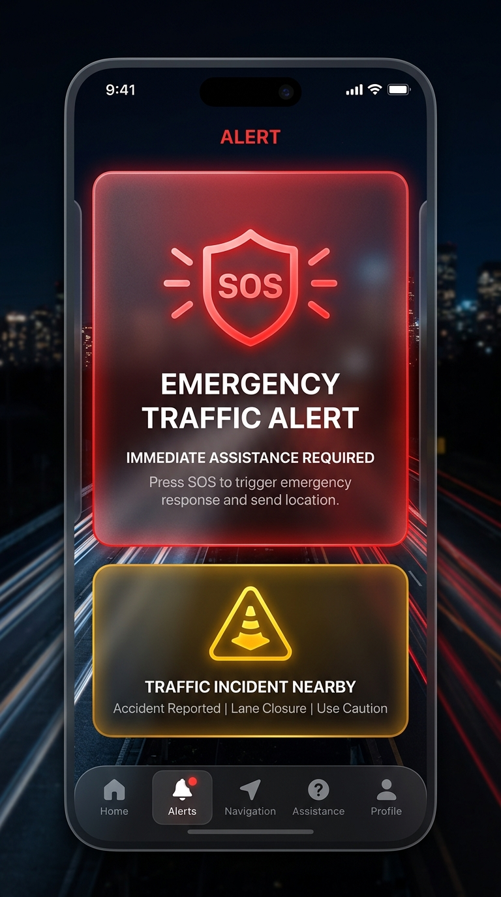
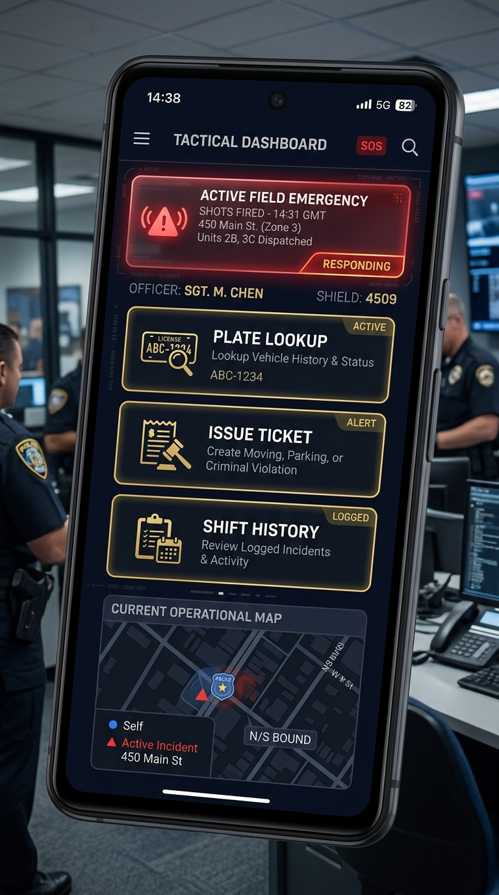

<div align="center">
  
  <h1>نظام مرور السودان الذكي (Smart Traffic Sudan) 🚥</h1>
  <p><b>منصة رقمية فخمة للإدارة العامة للمرور في السودان بتصميم زجاجي (Glassmorphism)</b></p>

  [](https://flutter.dev)
  [](https://android.com)
  
  <br>

  [-63_MB-2ea44f?style=for-the-badge)](https://raw.githubusercontent.com/mohammednaldeen412-ux/smart-traffic-sudan/master/docs/moror-app-v2.apk)
  
  <p><i>اضغط على الزر الأخضر أعلاه لتحميل وتثبيت التطبيق مباشرة في هاتفك!</i></p>
</div>

---

## 🌟 الميزات والتصميم الجديد (V2)

تم إعادة بناء التطبيق بالكامل ليواكب أحدث تقنيات التصميم العالمي، باستخدام تأثيرات **الزجاج (Glassmorphism)** الفخمة والألوان الداكنة العميقة `#0A0E17` مع إبراز التفاصيل.

### 🖼️ واجهات النظام:

<div align="center">
  <table>
    <tr>
      <td align="center"><b>لوحة المواطن (الرئيسية)</b></td>
      <td align="center"><b>نداء الطوارئ (SOS)</b></td>
      <td align="center"><b>رادار الضابط (الميداني)</b></td>
    </tr>
    <tr>
      <td></td>
      <td></td>
      <td></td>
    </tr>
  </table>
</div>

---

## 🚀 الميزات المتوفرة في النسخة الحالية

1. **تصميم زجاجي (Glassmorphism):**
   - واجهات شفافة وضبابية (Blur/BackdropFilter) تعطي طابعاً مستقبلياً فخماً.
   
2. **شاشة رادار الضابط:**
   - شاشة تكتيكية داكنة لمتابعة بلاغات الطوارئ فورياً باستخدام `StreamBuilder`.
   - إمكانية قراءة اللوحات ورصد المخالفات.

3. **نظام الطوارئ الفوري:**
   - التقاط الإحداثيات (GPS) الحقيقية ورفع البلاغ مباشرة للسيرفر (Cloud Firestore).
   - واجهة طوارئ حمراء متوهجة للفت الانتباه.

4. **إدارة المركبات وسجل المخالفات:**
   - عرض حالة السيارة (مرخصة / قيد المراجعة).
   - نظام اعتراض إلكتروني على المخالفات.

5. **بوابة الدفع والتسوية المالية:**
   - محاكاة للربط المباشر مع **بنكك (Bankak)** وتطبيقات الدفع القومية.
   - **(ميزة للتجربة):** تم توفير أرصدة افتراضية بقيمة `1,000,000 SDG` لحسابات الاختبار لتسهيل تجربة السداد.

---

## 🛠️ كيف تبدأ (للمطورين)

```bash
# استنساخ المشروع
git clone https://github.com/mohammednaldeen412-ux/smart-traffic-sudan.git

# الدخول لمجلد التطبيق
cd smart-traffic-sudan

# جلب الحزم المرفقة
flutter pub get

# تشغيل التطبيق على المحاكي
flutter run
```

---
<div align="center">
  <b>تم التصميم والبرمجة من أجل تقديم حل ذكي يخدم المرور والمواطن السوداني.</b>
</div>
